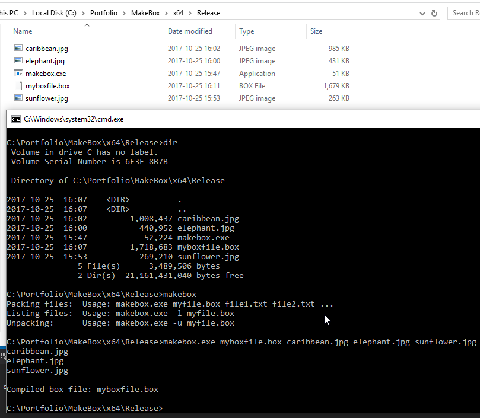
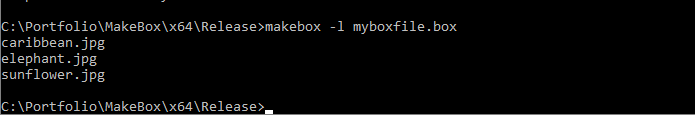
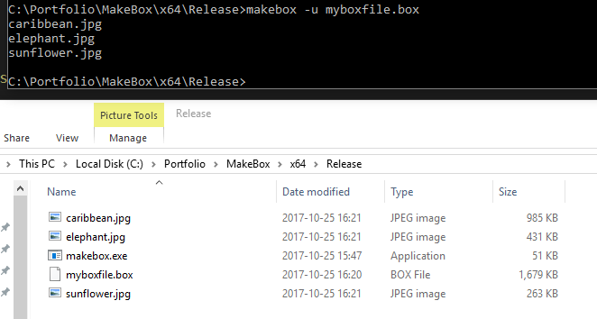
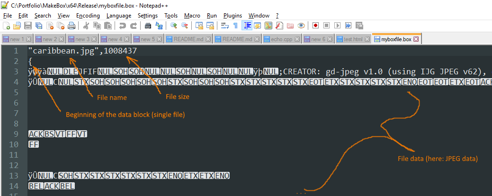

# MakeBox

The purpose of this project was to assemble all spesified files into an archive file. The archive can then unpack files back and still have the binaries verbatim. A small feature that I find neat to have was that you could list all files in the archive. This project is great for a game engine to be able to load assets for each game object. Say you have an unit, it will need to have: textures, shaders, sounds, scripts, animation data, stats etc. With this your users could mod the game units.

Tags: C++, Binary file
